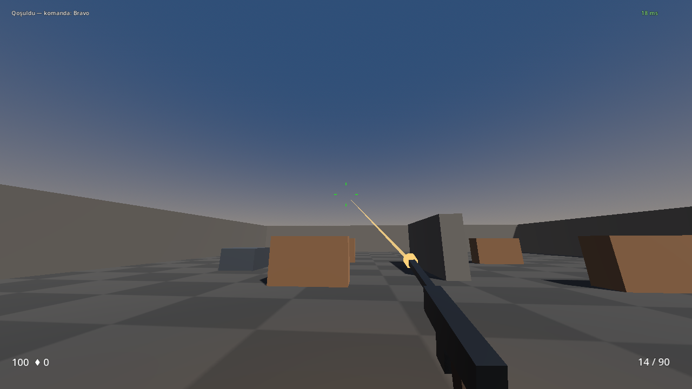

# NaxcivanCS

**Buraxılış: 0.3.0** · **Build: 0.3.0** · **Protokol: 2** · **Mərhələ: oynanıla bilən prototip**

NaxcivanCS Naxçıvan memarlığı və coğrafiyasından ilhamlanan, Godot 4 .NET və C# ilə hazırlanan müstəqil taktiki FPS layihəsidir. Məhsulun hədəfi 5v5 Bomb/Defuse oyunudur. Hazırkı build lokal və şəbəkə üzərindən hərəkət, tüfənglə atəş, damage, ölüm və respawn sınağı üçündür; tam competitive oyun hələ hazır deyil.

[Wiki](https://github.com/MuradoffTehmez/NaxcivanCS/wiki) · [Wiki-nin repodakı nüsxəsi](docs/wiki/Home.md) · [Dəyişikliklər](CHANGELOG.md) · [Texniki analiz](docs/PROJECT_ANALYSIS.md) · [Məhsul tələbləri](docs/PRD.md)



*Şəkil gunplay inkişaf budağındandır; fayl adındakı 0.3.0 buraxılış nömrəsi deyil.*

## Hazırda nə var?

| Sistem | 0.3.0 vəziyyəti |
|---|---|
| Dedicated server, ENet/UDP | 64 Hz simulyasiya, hər ikinci tick-də snapshot |
| Hərəkət | Lokal prediction, server reconciliation, uzaq oyunçu interpolation |
| Gunplay | AR-9 Qartal, server kadensiyası, ammo, manual/avtomatik reload, deterministik recoil |
| Vizual feedback | Prosedural silah modeli, muzzle flash, tracer, hitmarker, crosshair, HUD |
| Damage və respawn | Server hitscan, 200 ms tarixçə, 100 HP, təxminən 3 saniyəlik respawn |
| Backend | Health, versiya və yaddaşda saxlanan server registry |
| Shared qaydalar | Silah kataloqu, damage, economy, match və suspicion qaydaları |
| Hələ tamamlanmayıb | Bomb/Defuse, tam raund, alış, inventory, matchmaking, hesablar, səs, real xəritələr |

**Prototipin mühüm məhdudiyyətləri:** hitscan divar örtüyünü yoxlamır; friendly fire filtri qoşulmayıb; server_default.json runtime loader-ə bağlanmayıb. [Ətraflı məhdudiyyətlər](docs/KNOWN_ISSUES.md).

## Tez başlamaq

Repo Godot **4.7.2 .NET/Mono** SDK-sına və `net8.0` hədəfinə qurulub. Godot-un adi, C# dəstəyi olmayan build-i uyğun deyil. CI .NET 8 SDK istifadə edir; lokal yoxlamada .NET 10 SDK və .NET 8 runtime da işlədilib.

```bash
git clone https://github.com/MuradoffTehmez/NaxcivanCS.git
cd NaxcivanCS
dotnet build NaxcivanCS.sln -c Release
dotnet test NaxcivanCS.sln -c Release --no-build
bash tools/play.sh 2
```

Windows-da son əmr üçün **Git Bash** lazımdır. `play.sh` Godot layihələrini özü build edir. Solution yalnız shared, backend və testləri ehtiva edir; client/server ayrıca yığılır.

```bash
dotnet build server/NaxcivanCS.Server.csproj
dotnet build client/NaxcivanCS.Client.csproj
```

Godot avtomatik tapılmasa `GODOT_BIN`-i executable yoluna təyin edin. [Quraşdırma və PowerShell nümunələri](docs/wiki/Installation.md).

## İdarəetmə

| Düymə | Funksiya |
|---|---|
| Pəncərəyə sol klik | Kursoru tutmaq |
| W / A / S / D | Hərəkət |
| Mouse | Baxış |
| Sol klik / basılı saxlamaq | Tüfənglə atəş |
| R | Reload |
| Space | Tullanmaq |
| Ctrl | Çömbəlmək |
| Shift | Yavaş hərəkət |
| Esc | Kursoru buraxmaq |

Tab, B, E və G üçün input adları olsa da, tam scoreboard, alış, interaction və drop axınları hazır deyil. Shift üçün footstep səsi sistemi hələ yoxdur.

## Repo xəritəsi

| Yol | Təyinat |
|---|---|
| `client/` | Godot səhnəsi, kamera, input, render, HUD və effektlər |
| `server/` | Headless ENet server, simulyasiya, hitscan, oyunçu vəziyyəti |
| `shared/` | Godot-dan asılı olmayan modellər, qaydalar və binar protokol |
| `backend/` | ASP.NET Core minimal API |
| `config/` | 8 silah JSON-u və gələcək server konfiqurasiyası |
| `tests/` | xUnit testləri |
| `infrastructure/` | Docker və lokal PostgreSQL/Redis servis tərifləri |
| `localization/` | Azərbaycan, ingilis və rus dili resursları |
| `tools/` | Build/oynatma/smoke test və Wiki nəşr skriptləri |
| `docs/wiki/` | Oyunçu, proqramçı və operator üçün geniş Wiki |

## Sənədlər

- [Oyunçu bələdçisi](docs/wiki/Player-Guide.md), [silahlar](docs/wiki/Weapons.md), [xəritələr](docs/wiki/Maps.md)
- [Arxitektura](docs/ARCHITECTURE.md), [network protokolu](docs/wiki/Network-Protocol.md), [API](docs/wiki/Backend-API.md)
- [Töhfə qaydaları](CONTRIBUTING.md), [təhlükəsizlik](SECURITY.md), [dəstək](SUPPORT.md)
- [Test strategiyası](docs/TESTING.md), [buraxılış proseduru](docs/RELEASING.md), [yol xəritəsi](docs/ROADMAP.md)
- [Davranış qaydaları](CODE_OF_CONDUCT.md), [asset və müəlliflik qeydləri](ASSETS.md)

## Layihənin prinsipləri

Gameplay nəticəsinə server qərar verir. Client input göndərir; can, öldürmə və mükafat tələb etmir. Məhsul vizyonu rəqabətə, aydın görünüşə və kosmetik monetizasiyaya əsaslanır; store və pay-to-win mexanizmləri bu build-də yoxdur.

## Lisenziya və Müəlliflik Hüququ

NaxcivanCS proqram təminatı və mənbə kodu **[GNU General Public License v3.0 (GPL-3.0)](LICENSE)** altında lisenziyalaşdırılır.

* Layihədən istifadə edən, onu dəyişdirən və ya yayan hər kəs törəmə mənbə kodunu da eyni lisenziya şərtləri ilə açıq saxlamalıdır.
* Müəlliflik hüququ: © 2026 Tahmaz Muradov.
* Layihəyə istinad: [CITATION.cff](CITATION.cff)
* Üçüncü tərəf materialı əlavə etməzdən əvvəl mənşə və istifadə icazəsi qeyd edilməlidir; layihənin IP qaydası Valve/Counter-Strike xüsusi materiallarının icazəsiz köçürülməsini qəbul etmir ([ASSETS.md](ASSETS.md)).
