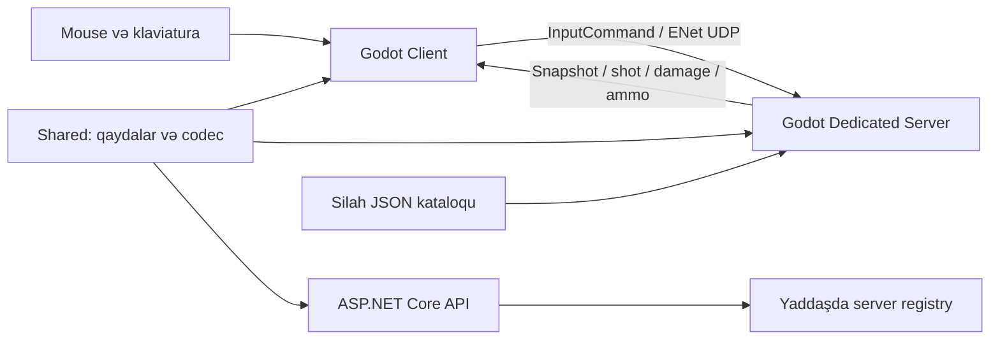

# NaxcivanCS — tətbiq edilmiş arxitektura

0.2.2 prototipinin arxitekturası. Məhsul hədəfi [PRD](PRD.md), tətbiq boşluqları [analizdə](PROJECT_ANALYSIS.md) göstərilir.

Backend ilə oyun serveri arasında avtomatik heartbeat axını hələ qurulmayıb. PostgreSQL və Redis Compose-də təsvir edilib, lakin API onları runtime-da istifadə etmir.

## Layihə sərhədləri

Shared `net8.0` kitabxanasıdır və System.Numerics istifadə edir. Client/server Godot.NET.Sdk/4.7.2 layihələridir. Root solution-a yalnız shared, backend və xUnit testləri daxildir; Godot layihələri ayrıca build olunur.

Client: GameBootstrap → WorldBuilder, NetworkClient, LocalPlayerController, PrototypeHud, RemotePlayerView, ShotEffects. LocalPlayerController kamera və ViewModel-i yaradır.

Server: ServerMain blockout kolliziyasını, GameWorld-u və NetworkServer-i yaradır. GameWorld hər tick-də movement, weapon, damage, history və respawn idarə edir. RoundController mövcuddur, lakin bu scene/lifecycle-a əlavə edilməyib.

## Şəbəkə və authority

Xam ENet paketləri 2 bayt little-endian MessageType başlığı daşıyır. Handshake protocol və username yoxlayır. Qoşulmuş client InputCommand göndərir; komanda sequence, timestamp, hərəkət oxları, yaw/pitch və düymələrdən ibarətdir.

Server 64 Hz işləyir, snapshot hər ikinci tick-də yayılır. Snapshot payload ölçüsü `14 + 32 × oyunçu sayı`-dır: 10 oyunçu üçün 334 bayt, MessageType ilə 336 bayt; ENet/UDP overhead bu rəqəmə daxil deyil.

Reliable: handshake və damage/death. Unreliable: input, snapshot, shot, ammo. Ammo yalnız hadisələrdə göndərildiyindən paket itkisi köhnə UI vəziyyəti yarada bilər.

## Hərəkət

Client eyni shared simulyasiya ilə lokal prediction edir; kolliziya Godot MoveAndSlide-a buraxılır. Server ackSeq qaytarır, client təsdiqlənmiş input-ları silir, fərq 8 sm-dən böyük olduqda mövqeni düzəldib qalan input-ları yenidən tətbiq edir. Uzaq oyunçular 100 ms gecikdirilmiş render vaxtına interpolate olunur.

Serverdə 32 input-luq növbə və tick başına 4 input limiti var. Hər input tam delta ilə simulyasiya edildiyindən bu limit ümumi tick movement büdcəsi zəmanəti vermir. Tam deterministik kolliziya və daha sərt vaxt büdcəsi gələcək işdir.

## Silah və damage

WeaponRuntime hər oyunçu üçün şarjor, reserve, reload və recoil saxlayır. GameWorld TickWeapon-u hər server tick-ində bir dəfə çağırır. Tətik basılılığı ammo/interval yoxlamasından sonra Fire yaradır; sonra HitValidator hədəfləri latency qədər rewind edib hitscan və DamageRules tətbiq edir.

Silah recoil-i serverdə istiqamətə təsir edir. Client həmin nəticədən vizual kick və tracer yaradır. Bu build-də divar occlusion, təsadüfi spread, penetration və pellet loop tam atəş yoluna qoşulmayıb.

## Konfiqurasiya

Silah JSON-ları startup-da WeaponCatalog ilə oxunur. Server əvvəl repo config yolunu, sonra user config və assembly yaxınlığındakı config yolunu axtarır. Hamı weapon_rifle_01 ilə başlayır.

server_default.json üçün runtime loader yoxdur. Tick, maxPlayers, round/economy default-ları kod/proyekt konfiqurasiyasında qalır. JSON redaktəsi avtomatik olaraq bütün gameplay parametrlərini dəyişmir; hot reload da yoxdur.

## Lisenziya və authority əlaqəsi

Layihə GPLv3-dür: istənilən kəs client-i və serveri fork edib yaya bilər.
Bu, arxitekturaya konkret tələb qoyur — **client-in özündə saxladığı heç bir
dəyər etibarlı sayıla bilməz**, çünki dəyişdirilmiş client mənbədən qurula bilər.

PRD 156 onsuz da bunu tələb edir; GPLv3 sadəcə seçimi məcburi edir:

| Sahə | Harada təyin olunur | Fork edilmiş client nə edə bilər |
|---|---|---|
| Health, damage, kill | Dedicated server | Heç nə — server hesablayır |
| Atəş kadensiyası, recoil | Dedicated server | Heç nə — server qərar verir |
| Hərəkət sürəti | Dedicated server (validasiya) | Heç nə — server rədd edir |
| **Cosmetics inventarı** | **Backend (PostgreSQL)** | Yalnız özünə göstərə bilər |
| Rank, MMR, XP | Backend | Heç nə |

Cosmetics üçün nəticə (PRD 73, 90): satın alınmış skin-lərin siyahısı backend-də
saxlanılmalı və **match serverinə backend-dən gəlməlidir**, client-dən yox.
Fork edilmiş client özünə istənilən skin göstərə bilər, lakin digər oyunçular
serverin təsdiqlədiyini görür. Monetizasiyanın bütövlüyü buna bağlıdır.

## Versiya sərhədi

Build/game/content 0.2.2; Git teqi 0.2.2; protocol 2. Handshake yalnız protocol bərabərliyini yoxlayır. Content hash və patch doğrulaması hələ yoxdur.

Daha ətraflı: [Client](wiki/Client.md), [Server](wiki/Dedicated-Server.md), [Protocol](wiki/Network-Protocol.md), [API](wiki/Backend-API.md).
