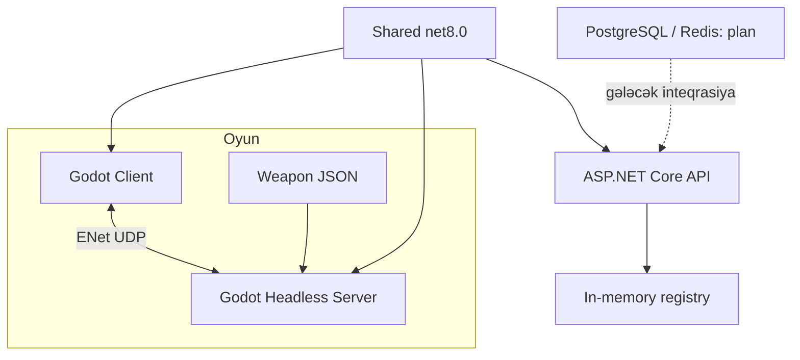

# Proqram arxitekturası

## Məqsəd

Oyun nəticəsi dedicated serverdə hesablanır, client görüntü və input üçün cavabdehdir. Backend oyun tick loop-undan ayrıdır. Shared bütün tərəflərin başa düşdüyü modelləri, qaydaları və protocol formatını daşıyır.

Server → backend heartbeat və stats upload oxları bu build-də runtime-da yoxdur. Compose asılılığının olması tətbiqin həmin DB-dən istifadə etməsi demək deyil.

## Məsuliyyət bölgüsü

Client mouse/keyboard girişini toplamaq, lokal hərəkəti proqnozlaşdırmaq, remote modeli interpolate etmək və server hadisəsindən effekt göstərmək üçün işləyir.

Server giriş növbəsini emal edir, movement/kolliziya, silah tick-i, hitscan, damage, history və respawn hesablayır. Client-dən “mən vurdum”, “pul ver” və ya “rank dəyiş” əmri qəbul edilmir.

Backend hazırda yalnız versiya və server registry təqdim edir. Account, session, stats, matchmaking, MMR və bans PRD hədəfləridir.

## Əsas dizayn qərarları

**Ayrı Godot layihələri:** client və server fərqli scene quruluşuna malikdir. Xam ENet codec eyni node yoluna əsaslanan RPC ehtiyacını aradan qaldırır.

**Shared-də System.Numerics:** engine runtime olmadan unit test və backend build mümkündür.

**JSON silah kataloqu:** weapon statları build dəyişmədən redaktə edilə bilir, amma server restart tələb olunur.

**Prediction və interpolation:** lokal cavab və remote görüntü üçün fərqli üsullar istifadə olunur. Server nəticəsi əsasdır, lakin vizual cavab hər dəfə network round-trip gözləmir.

## İnteqrasiya boşluqları

RoundController node-u cari scene lifecycle-a daxil deyil. Economy helper-ləri alış axınına bağlanmayıb. Movement/weapon config sahələrinin hamısı tətbiq edilmir. “Server authoritative” burada düzgün məsuliyyət istiqamətidir; bütün validation və anti-cheat işlərinin bitdiyi anlamına gəlmir.

[Əsas arxitektura sənədi](../ARCHITECTURE.md) · [Client](Client.md) · [Server](Dedicated-Server.md) · [Analiz](Roadmap-and-Analysis.md)
