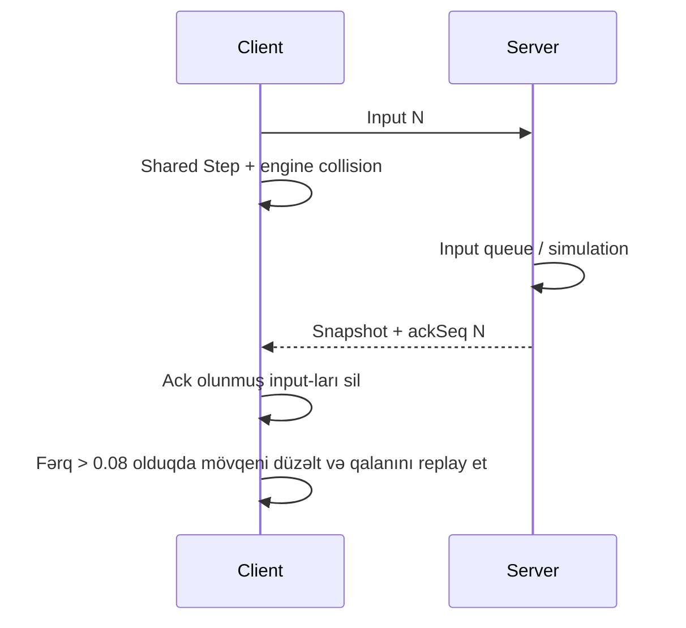

# Prediction, reconciliation və lag compensation

## Niyə üç mexanizm var?

Lokal oyunçu düyməyə cavabı dərhal görməlidir. Digər oyunçunun görünüşü aralı snapshot-lardan hamar qurulmalıdır. Atəş nəticəsi isə serverin etibarlı vəziyyətinə əsaslanmalıdır. Bu ehtiyaclar prediction, interpolation və lag compensation ilə ayrı həll olunur.

## Lokal prediction və reconciliation

Client ən çox 128 pending input saxlayır. Server ackSeq son emal etdiyi sequence-dir. Snapshot-da velocity və grounded olmadığı üçün reconciliation bütün state-i tam yenidən qurmur; bu, təkmilləşdirmə nöqtəsidir.

## Remote interpolation

GameBootstrap son server vaxtı, lokal render keçən vaxtı və 100 ms delay istifadə edir. RemotePlayerView bu render vaxtına uyğun iki snapshot arasında görüntü qurur. Məqsəd jitter-i azaltmaqdır; bu delay input latency-si ilə eyni anlayış deyil.

## Server tick və snapshot

Physics 64 Hz, snapshot hər 2 tick-dir. Paketlər unreliable göndərilir ki, köhnə mövqe yenidən ötürülərək yeni məlumatın qabağında gecikmə yaratmasın. Bunun əvəzində sıra/itki və state bərpası diqqətlə idarə olunmalıdır.

## Lag compensation

Hər oyunçunun mövqe/yaw/crouch tarixçəsi server vaxtı ilə saxlanır. Atış zamanı ENet RTT/2 təxmini latency kimi istifadə edilir. ResolveRewindTime maksimum 200 ms tarixçəni nəzərə alır. ClientTimeMs-dən gələn iddia birbaşa hit vaxtının authority-si deyil.

Rewind target mövqeyini geri çəkir; statik dünya occlusion-u və bütün gameplay state tarixçəsini yenidən simulyasiya etmir. Hazır HitValidator divarları yoxlamadığından “lag compensation var” ifadəsi “bütün hit registration tamamdır” demək deyil.

## Paket itkisi və cadence

Input olmayan tick-də düymələr None olur. Bu, davamlı tətikin itən input-lardan təsirlənməsinə səbəb ola bilər. WeaponState də unreliable/event-only olduğu üçün ammo UI üçün bərpa yolu tələb olunur.

## Nə ölçülməlidir?

10 oyunçuda tick vaxtı, snapshot intervalı, RTT, packet loss, reconciliation sayı və atəş event gecikməsi ölçülməlidir. 50/100/200 ms gecikmə və müxtəlif loss ssenariləri üçün sabit nəticə ayrıca qeyd olunmalıdır. Cari iki client smoke testi yalnız əsas borunun işlədiyini təsdiqləyir.

[Movement](Movement.md) · [Protocol](Network-Protocol.md) · [Known issues](../KNOWN_ISSUES.md)
